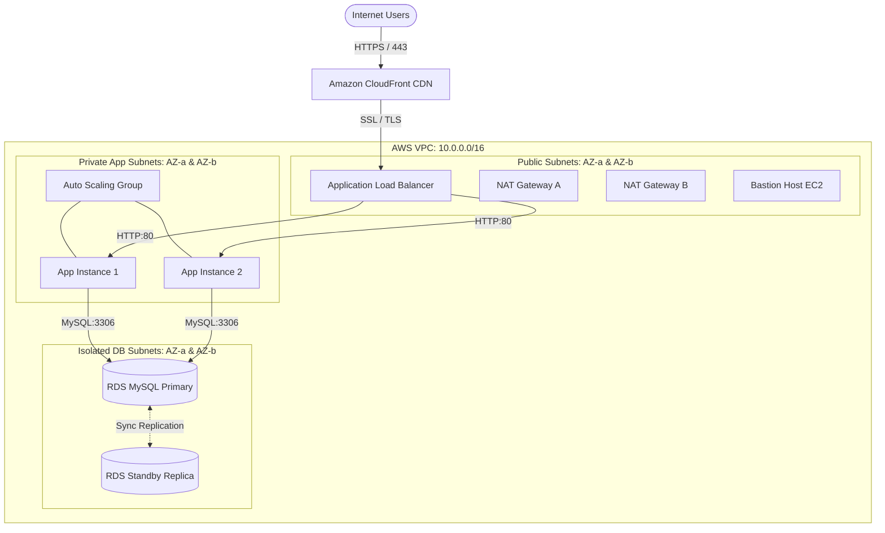

#This repository contains Terraform code to deploy a 2-tier application on Amazon Web Services (AWS)
## Architecture Diagram

```mermaid
flowchart TD
    Users([Internet Users]) -->|HTTPS / 443| CF[Amazon CloudFront CDN]
    CF -->|SSL / TLS| ALB[Application Load Balancer]
    
    subgraph VPC [AWS VPC: 10.0.0.0/16]
        subgraph PublicSubnets [Public Subnets: AZ-a & AZ-b]
            ALB
            NAT_A[NAT Gateway A]
            NAT_B[NAT Gateway B]
            Bastion[Bastion Host EC2]
        end
        
        subgraph PrivateAppSubnets [Private App Subnets: AZ-a & AZ-b]
            ASG[Auto Scaling Group]
            EC2_A[App Instance 1]
            EC2_B[App Instance 2]
            ASG --- EC2_A
            ASG --- EC2_B
        end
        
        subgraph PrivateDBSubnets [Isolated DB Subnets: AZ-a & AZ-b]
            RDS_Primary[(RDS MySQL Primary)]
            RDS_Standby[(RDS Standby Replica)]
            RDS_Primary <-.->|Sync Replication| RDS_Standby
        end
        
        ALB -->|HTTP:80| EC2_A
        ALB -->|HTTP:80| EC2_B
        EC2_A -->|MySQL:3306| RDS_Primary
        EC2_B -->|MySQL:3306| RDS_Primary
    end
```

